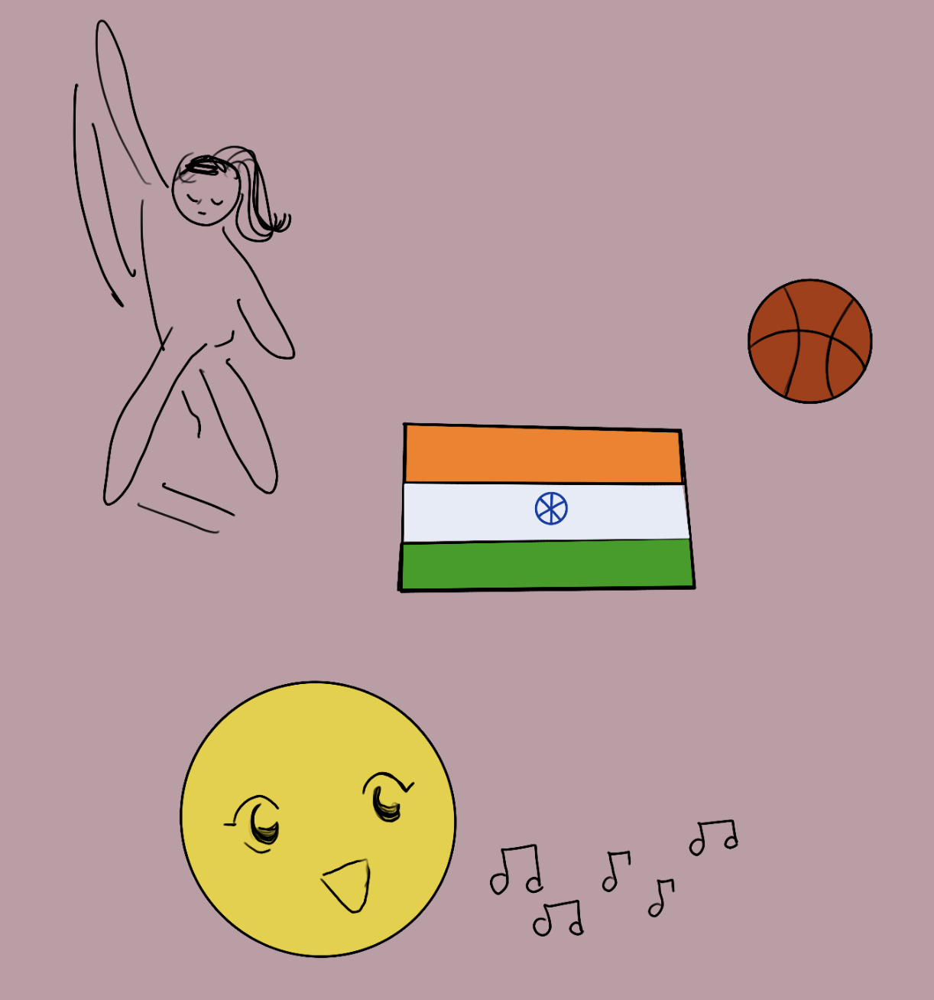

# Priya's CSP Home Page 
Yayyy!!! I figured it out finally!!!
!!!

## A little Bit About Me!
I am a Junior at DNHS, and a 16 year old. I am also a Indian Classical dancer, basketball player, singer, and someone who loves to try new things. I also love to travel, and be in nature. I have moved 6 different schools in the past 11 years, which taught me how to adapt to different surroundings and evironments.  

## My Goals for This Year!
My main goal for this year, in this class, is to understand the foundation of how to code and learn how to create an application or something of my own for one of my personal interests. Antoher one of my goals for this year is to be more organized and have better time management.But, my number one goal for the year in a broad view, is to figure out which career path I'm going to pick and take in college.

## Hacks
- ALWAYS BRING YOUR COMPUTER TO CLASS! (You need to be able access your tools)
- Collaborators will only be able to access your code after you push it to Github, which will then make it go out of local host.
- Everything is already set as default, so that we don't have to code from the very basics, we can change the layout and still learn through the process.

